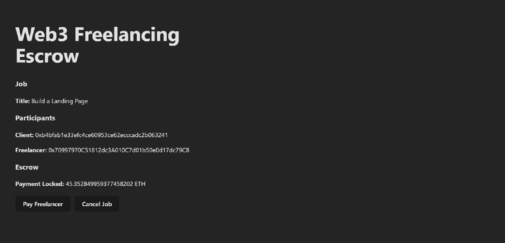

# Web3 Freelancing Escrow DApp

## Demo



A minimal Web3 freelancing escrow MVP that enables trustless payments between a client and a freelancer using smart contracts.

The client locks ETH in an escrow contract, and funds are released to the freelancer only after job approval. If the job is cancelled, the client can refund the funds.

---

## Features

- Smart contract–based escrow
- Wallet connection (MetaMask)
- ETH locked securely in contract
- Client can release payment to freelancer
- Client can refund payment if job is cancelled
- Simple React frontend connected to blockchain

---

## Tech Stack

- Solidity
- Hardhat
- Ethers.js
- React + Vite
- MetaMask

---

## How It Works

1. Client deploys escrow contract with freelancer address and ETH
2. Funds are locked in the smart contract
3. Client releases payment after work completion
4. Or client refunds payment if job is cancelled

---

## Run Locally

```bash
git clone https://github.com/Pranjal-077/web3-Freelancing.git
cd web3-Freelancing
yarn install
cd escrow
yarn hardhat compile
yarn hardhat run scripts/deploy.js
cd ..
yarn dev
